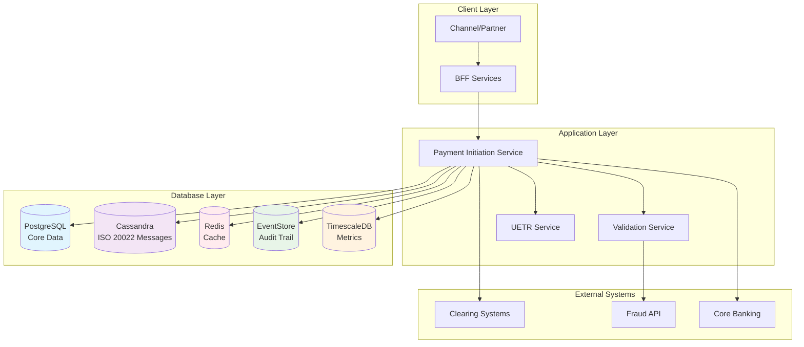
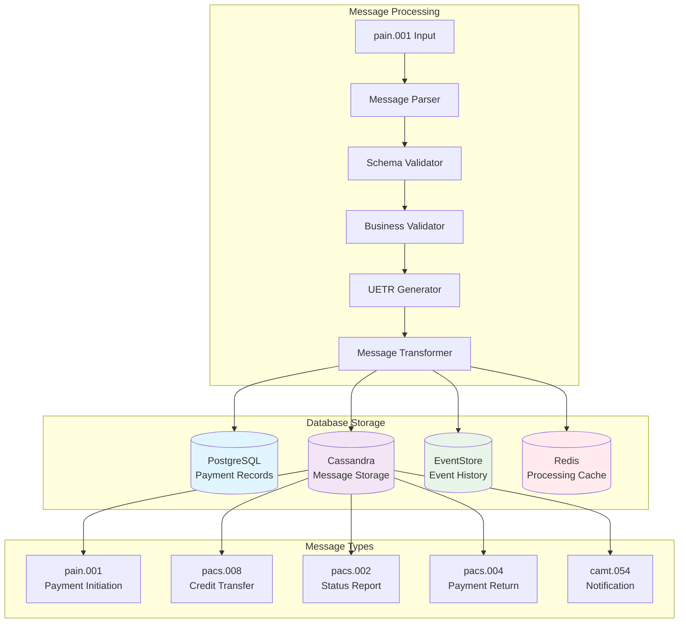
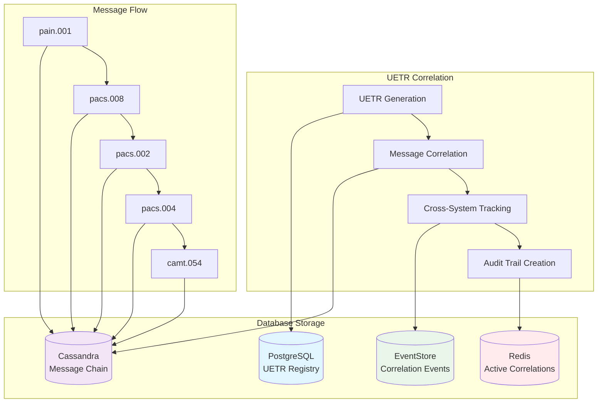
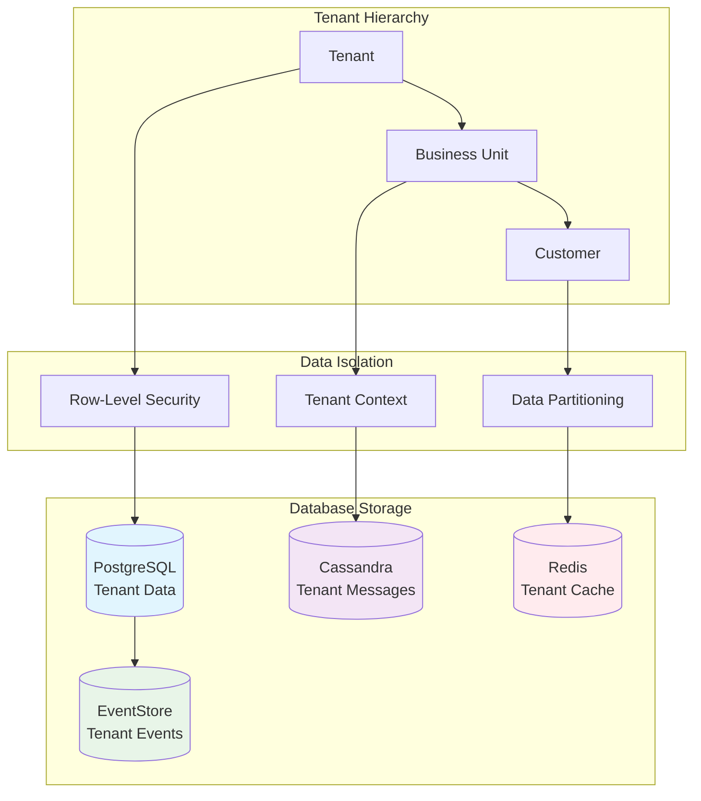
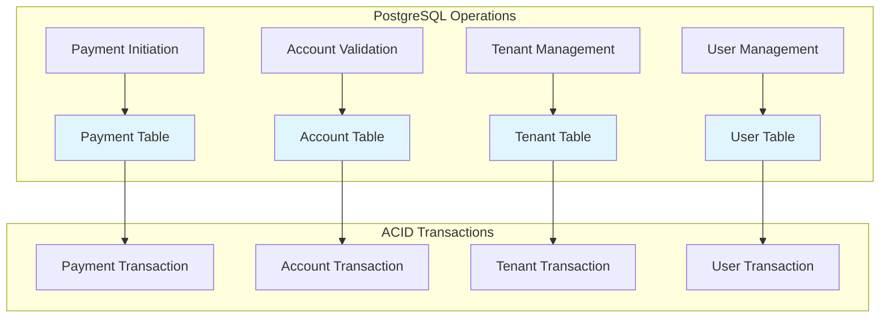
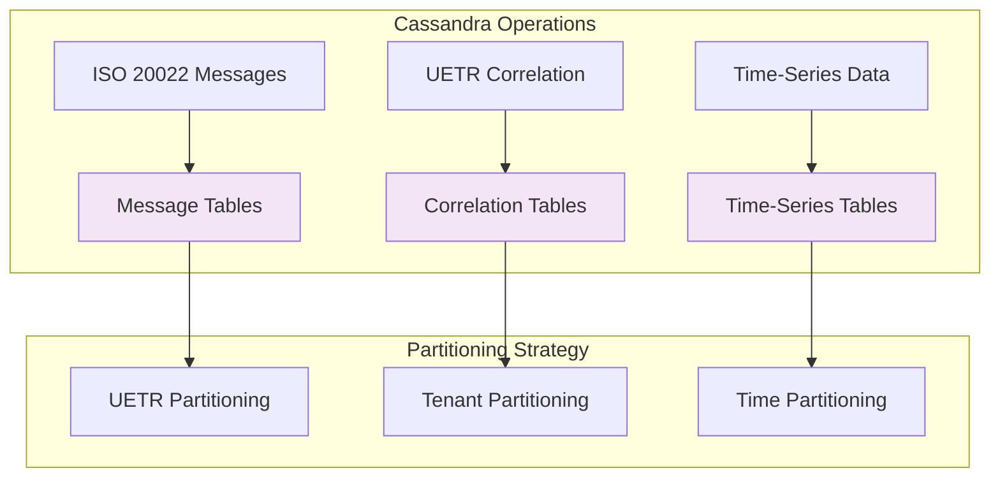
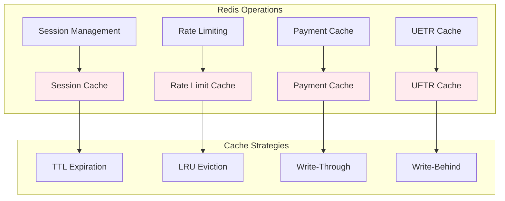
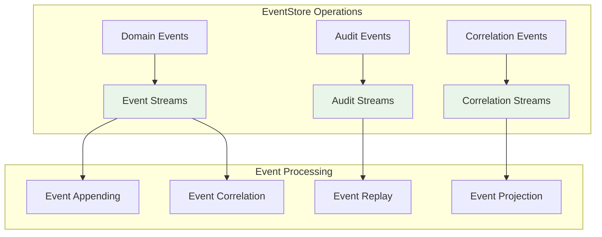
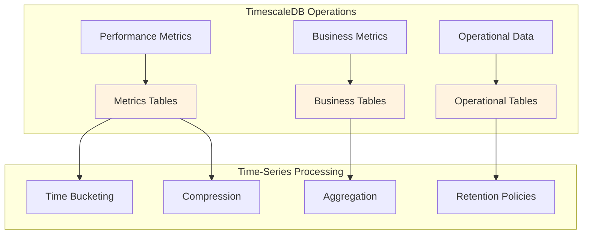

# Data Flow Diagram v2 - Polyglot Persistence Data Flow

## 🎯 **Data Flow Overview**

The Payments Engine v2 implements a sophisticated polyglot persistence strategy with data flowing across multiple specialized databases. This document provides comprehensive data flow diagrams showing how data moves between PostgreSQL, Cassandra, Redis, EventStore, and TimescaleDB.

## 🏗️ **Polyglot Persistence Architecture**

### **Database Specialization**
```yaml
PostgreSQL:
  - Core transactional data
  - ACID compliance
  - Relational integrity
  - Multi-tenant isolation (RLS)

Cassandra:
  - High-volume ISO 20022 messages
  - Time-series data
  - Horizontal scaling
  - UETR-based partitioning

Redis:
  - Real-time caching
  - Session management
  - Rate limiting
  - Temporary data

EventStore:
  - Immutable audit trails
  - Event sourcing
  - Message correlation history
  - Compliance data

TimescaleDB:
  - Operational intelligence
  - Time-series analytics
  - Performance metrics
  - Business intelligence
```

## 📊 **Data Flow Patterns**

### **1. Payment Initiation Flow**



### **2. ISO 20022 Message Processing Flow**



### **3. UETR Correlation Flow**



### **4. Multi-Tenant Data Flow**



## 🔄 **Data Flow Patterns**

### **1. Write Pattern (Payment Creation)**

```yaml
Data Flow Sequence:
  1. Client Request → BFF Service
  2. BFF Service → Payment Initiation Service
  3. Payment Service → PostgreSQL (Core Data)
  4. Payment Service → Cassandra (ISO 20022 Messages)
  5. Payment Service → EventStore (Audit Trail)
  6. Payment Service → Redis (Cache)
  7. Payment Service → TimescaleDB (Metrics)

Database Operations:
  - PostgreSQL: INSERT payment record
  - Cassandra: INSERT pain.001 message
  - EventStore: APPEND payment initiated event
  - Redis: SET payment cache
  - TimescaleDB: INSERT payment metrics
```

### **2. Read Pattern (Payment Query)**

```yaml
Data Flow Sequence:
  1. Client Query → BFF Service
  2. BFF Service → Payment Query Service
  3. Payment Query Service → Redis (Cache Check)
  4. If Cache Miss → PostgreSQL (Core Data)
  5. If Cache Miss → Cassandra (Message Data)
  6. Payment Query Service → Redis (Cache Update)
  7. Response → Client

Database Operations:
  - Redis: GET payment cache
  - PostgreSQL: SELECT payment record
  - Cassandra: SELECT message data
  - Redis: SET payment cache
```

### **3. Event Sourcing Pattern**

```yaml
Data Flow Sequence:
  1. Domain Event → Event Publisher
  2. Event Publisher → EventStore (Append Event)
  3. Event Publisher → Kafka (Event Stream)
  4. Event Store → Projection Updates
  5. Projection Updates → Read Models

Database Operations:
  - EventStore: APPEND domain event
  - Kafka: PUBLISH event message
  - PostgreSQL: UPDATE read models
  - Cassandra: UPDATE message status
```

## 📊 **Database-Specific Data Flows**

### **PostgreSQL Data Flow**



### **Cassandra Data Flow**



### **Redis Data Flow**



### **EventStore Data Flow**



### **TimescaleDB Data Flow**



## 🔄 **Cross-Database Data Synchronization**

### **1. Payment Status Synchronization**

```yaml
Synchronization Flow:
  1. Payment Status Change → PostgreSQL (Core Status)
  2. Status Change Event → EventStore (Audit Trail)
  3. Status Update → Cassandra (Message Status)
  4. Status Cache → Redis (Real-time Access)
  5. Status Metrics → TimescaleDB (Analytics)

Consistency Strategy:
  - Eventual Consistency for non-critical data
  - Strong Consistency for payment status
  - Compensating Actions for failures
  - Event-driven synchronization
```

### **2. UETR Correlation Synchronization**

```yaml
Synchronization Flow:
  1. UETR Generation → PostgreSQL (UETR Registry)
  2. UETR Event → EventStore (Correlation Events)
  3. Message Chain → Cassandra (Message Correlation)
  4. Active UETR → Redis (Processing Cache)
  5. UETR Metrics → TimescaleDB (Correlation Analytics)

Consistency Strategy:
  - Strong Consistency for UETR registry
  - Eventual Consistency for message chains
  - Event-driven correlation updates
  - Compensating actions for correlation failures
```

## 📊 **Data Flow Metrics**

### **Performance Targets**

```yaml
PostgreSQL:
  - Write Latency: <10ms
  - Read Latency: <5ms
  - Throughput: 1000 TPS
  - Availability: 99.99%

Cassandra:
  - Write Latency: <5ms
  - Read Latency: <3ms
  - Throughput: 10,000 TPS
  - Availability: 99.99%

Redis:
  - Write Latency: <1ms
  - Read Latency: <1ms
  - Throughput: 50,000 TPS
  - Availability: 99.99%

EventStore:
  - Write Latency: <5ms
  - Read Latency: <10ms
  - Throughput: 5,000 TPS
  - Availability: 99.99%

TimescaleDB:
  - Write Latency: <10ms
  - Read Latency: <20ms
  - Throughput: 1,000 TPS
  - Availability: 99.99%
```

### **Data Volume Projections**

```yaml
Daily Data Volume:
  - PostgreSQL: 50GB
  - Cassandra: 200GB
  - Redis: 10GB
  - EventStore: 100GB
  - TimescaleDB: 50GB
  - Total: 410GB/day

Monthly Data Volume:
  - PostgreSQL: 1.5TB
  - Cassandra: 6TB
  - Redis: 300GB
  - EventStore: 3TB
  - TimescaleDB: 1.5TB
  - Total: 12.3TB/month

Retention Policies:
  - PostgreSQL: 7 years
  - Cassandra: 3 years
  - Redis: 24 hours
  - EventStore: 7 years
  - TimescaleDB: 2 years
```

## 🚀 **Implementation Guidelines**

### **1. Database Connection Management**

```yaml
Connection Pooling:
  - PostgreSQL: HikariCP (20 connections)
  - Cassandra: DataStax Driver (50 connections)
  - Redis: Jedis Pool (100 connections)
  - EventStore: gRPC (10 connections)
  - TimescaleDB: HikariCP (20 connections)

Connection Strategies:
  - Read Replicas for read-heavy operations
  - Write-Ahead Logging for durability
  - Connection Failover for availability
  - Circuit Breakers for resilience
```

### **2. Data Consistency Strategies**

```yaml
Consistency Levels:
  - Strong Consistency: Payment status, UETR registry
  - Eventual Consistency: Message chains, metrics
  - Session Consistency: User sessions, cache
  - Bounded Staleness: Analytics, reporting

Consistency Patterns:
  - Saga Pattern for distributed transactions
  - Event Sourcing for audit trails
  - CQRS for read/write separation
  - Compensating Actions for rollbacks
```

### **3. Data Migration Strategies**

```yaml
Migration Patterns:
  - Blue-Green Deployment for zero downtime
  - Canary Deployment for gradual rollout
  - Feature Flags for controlled migration
  - Rollback Strategies for failure recovery

Migration Tools:
  - Flyway for PostgreSQL migrations
  - Cassandra migration scripts
  - Redis data migration tools
  - EventStore projection updates
  - TimescaleDB hypertable management
```

---

**Version**: 2.0  
**Last Updated**: 2025-01-27  
**Status**: 🚀 Ready for Implementation  
**Next Review**: Weekly during implementation
