# Data Flow Visual Diagrams v2 - Mermaid Diagrams

## 🎯 **Visual Data Flow Diagrams**

This document contains Mermaid diagrams showing the data flow across all databases in the Payments Engine v2 architecture.

## 📊 **1. Payment Initiation Data Flow**

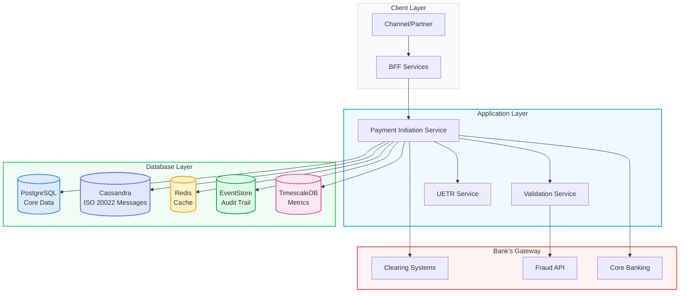
*Note: The "Bank's Gateway" subgraph represents the banking institution's own infrastructure for connecting to external systems. The Payments Engine does not connect to these systems directly.*

## 📊 **2. ISO 20022 Message Processing Flow**

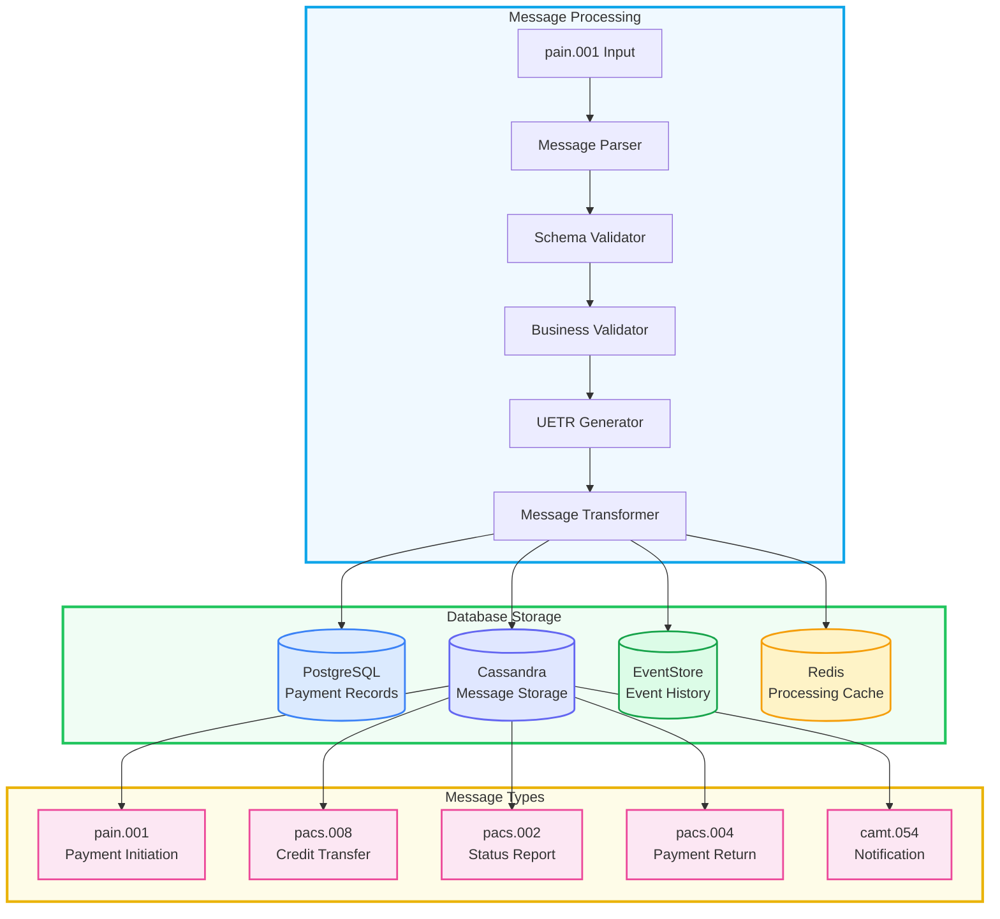

## 📊 **3. UETR Correlation Flow**

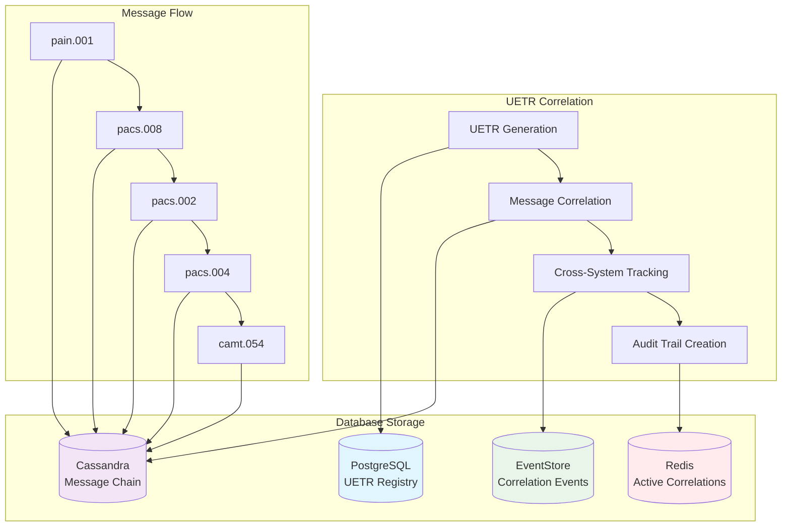

## 📊 **4. Multi-Tenant Data Flow**

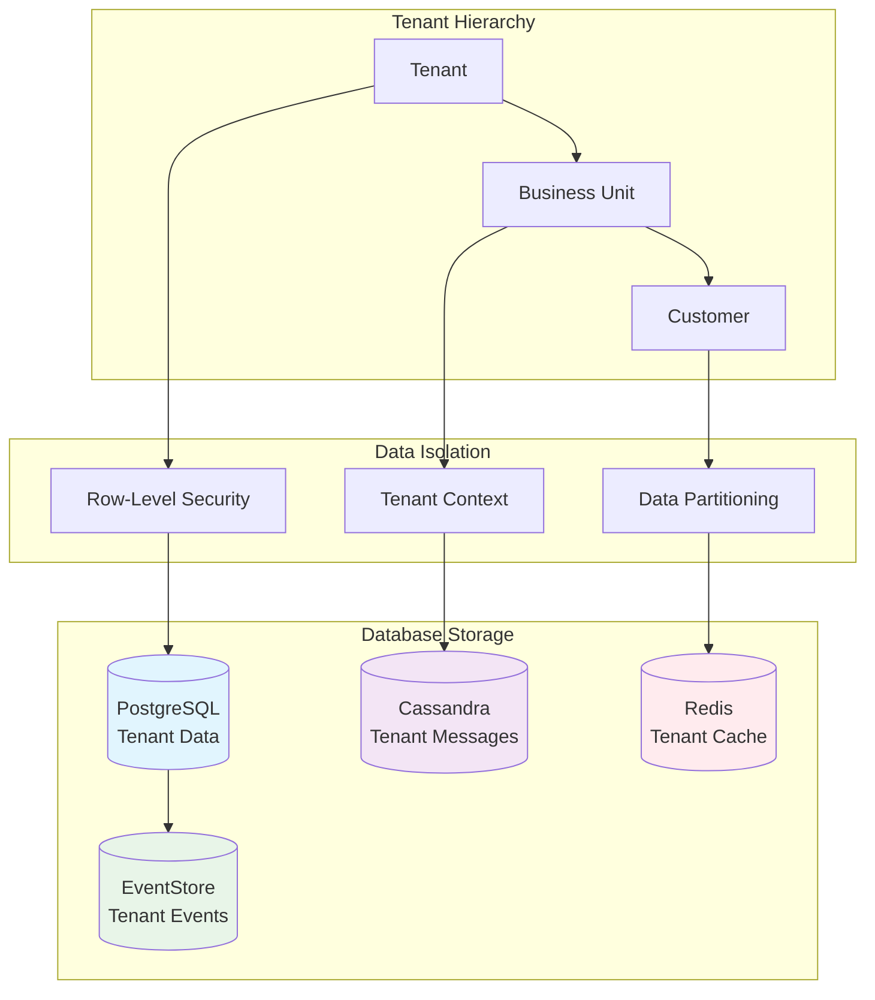

## 📊 **5. Database-Specific Data Flows**

### **PostgreSQL Data Flow**

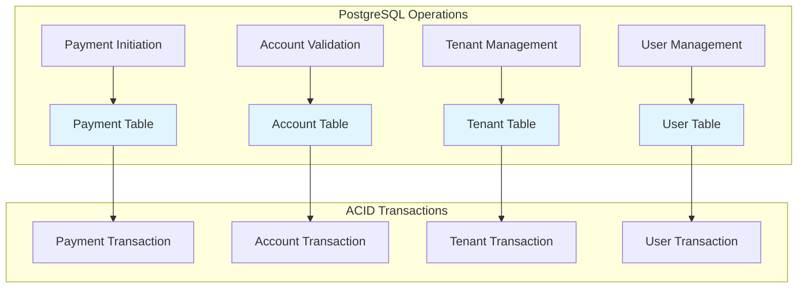

### **Cassandra Data Flow**

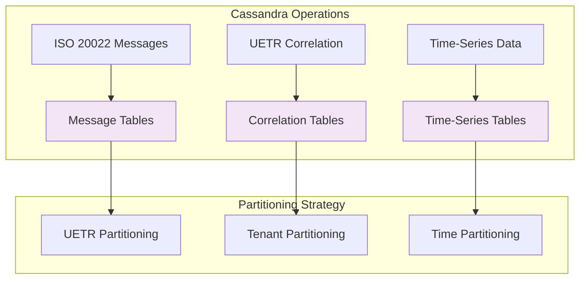

### **Redis Data Flow**

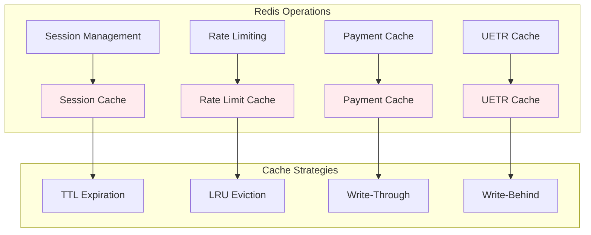

### **EventStore Data Flow**

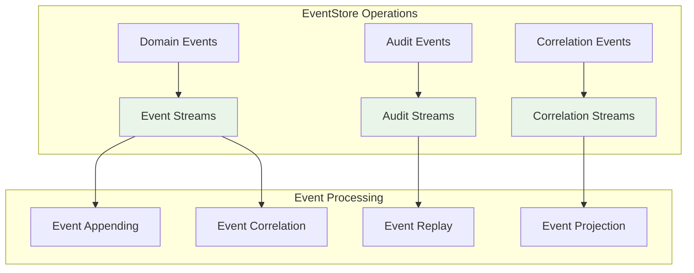

### **TimescaleDB Data Flow**

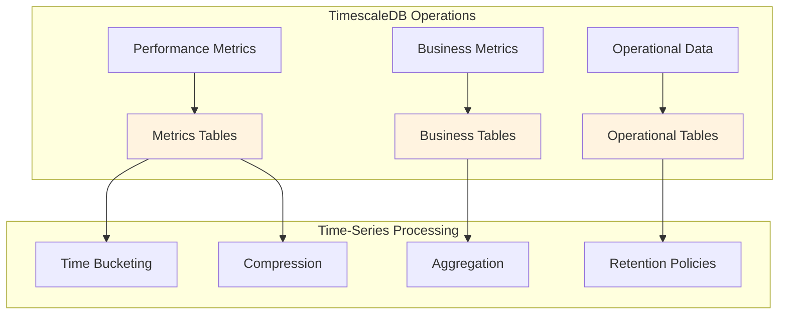

## 📊 **6. Cross-Database Synchronization**

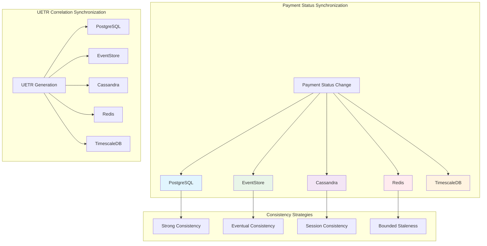

## 📊 **7. Data Volume and Performance Flow**

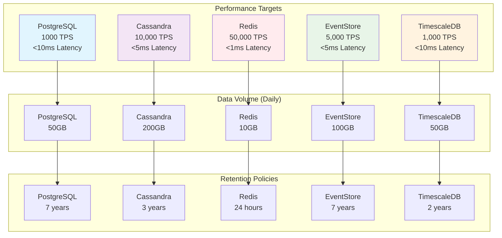

## 🎯 **Key Data Flow Insights**

### **1. Write Patterns**
- **PostgreSQL**: ACID transactions for core data
- **Cassandra**: High-volume message storage
- **Redis**: Real-time caching and sessions
- **EventStore**: Immutable audit trails
- **TimescaleDB**: Time-series analytics

### **2. Read Patterns**
- **PostgreSQL**: Complex queries and joins
- **Cassandra**: Fast lookups by UETR/tenant
- **Redis**: Sub-millisecond cache access
- **EventStore**: Event replay and correlation
- **TimescaleDB**: Time-based analytics

### **3. Consistency Patterns**
- **Strong Consistency**: Payment status, UETR registry
- **Eventual Consistency**: Message chains, metrics
- **Session Consistency**: User sessions, cache
- **Bounded Staleness**: Analytics, reporting

### **4. Performance Characteristics**
- **PostgreSQL**: 1000 TPS, <10ms latency
- **Cassandra**: 10,000 TPS, <5ms latency
- **Redis**: 50,000 TPS, <1ms latency
- **EventStore**: 5,000 TPS, <5ms latency
- **TimescaleDB**: 1,000 TPS, <10ms latency

---

**Version**: 2.0  
**Last Updated**: 2025-01-27  
**Status**: 🚀 Ready for Implementation  
**Next Review**: Weekly during implementation
