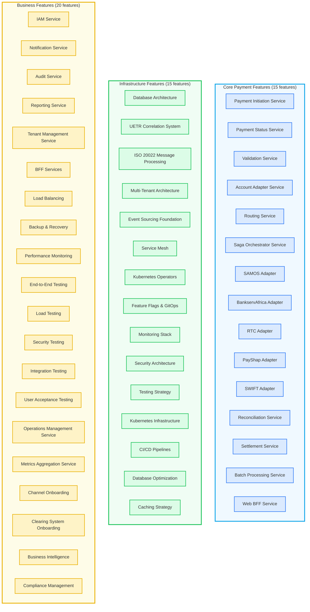
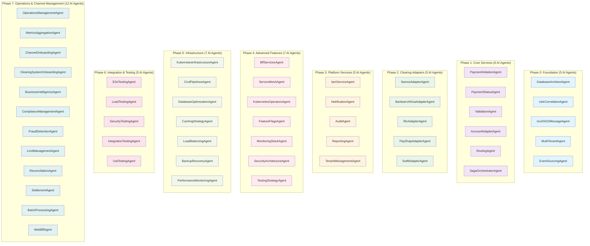
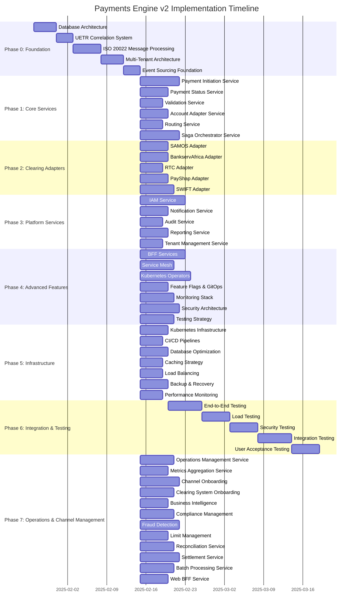
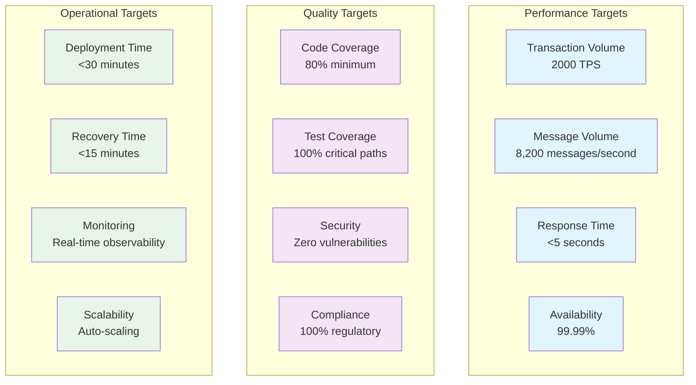

# Feature Breakdown Visual v2 - Mermaid Diagrams

## 🎯 **Visual Feature Breakdown**

This document contains Mermaid diagrams showing the feature breakdown for the Payments Engine v2 architecture.

## 📊 **1. 8-Phase Implementation Overview**

```mermaid
graph TB
    subgraph P0["Phase 0: Foundation (Sequential)"]
        A[Database Architecture]
        B[UETR Correlation]
        C[ISO 20022 Messages]
        D[Multi-Tenant Architecture]
        E[Event Sourcing]
    end
    
    subgraph P1["Phase 1: Core Services (Parallel)"]
        F[Payment Initiation]
        G[Payment Status]
        H[Validation Service]
        I[Account Adapter]
        J[Routing Service]
        K[Saga Orchestrator]
    end
    
    subgraph P2["Phase 2: Clearing Adapters (Parallel)"]
        L[SAMOS Adapter]
        M[BankservAfrica Adapter]
        N[RTC Adapter]
        O[PayShap Adapter]
        P[SWIFT Adapter]
    end
    
    subgraph P3["Phase 3: Platform Services (Parallel)"]
        Q[IAM Service]
        R[Notification Service]
        S[Audit Service]
        T[Reporting Service]
        U[Tenant Management]
    end
    
    subgraph P4["Phase 4: Advanced Features (Parallel)"]
        V[BFF Services]
        W[Service Mesh]
        X[Kubernetes Operators]
        Y[Feature Flags]
        Z[Monitoring Stack]
        AA[Security Architecture]
        BB[Testing Strategy]
    end
    
    subgraph P5["Phase 5: Infrastructure (Parallel)"]
        CC[Kubernetes Infrastructure]
        DD[CI/CD Pipelines]
        EE[Database Optimization]
        FF[Caching Strategy]
        GG[Load Balancing]
        HH[Backup & Recovery]
        II[Performance Monitoring]
    end
    
    subgraph P6["Phase 6: Integration & Testing (Sequential)"]
        JJ[End-to-End Testing]
        KK[Load Testing]
        LL[Security Testing]
        MM[Integration Testing]
        NN[User Acceptance Testing]
    end
    
    subgraph P7["Phase 7: Operations & Channel Management (Parallel)"]
        OO[Operations Management]
        PP[Metrics Aggregation]
        QQ[Channel Onboarding]
        RR[Clearing System Onboarding]
        SS[Business Intelligence]
        TT[Compliance Management]
        UU[Fraud Detection]
        VV[Limit Management]
        WW[Reconciliation Service]
        XX[Settlement Service]
        YY[Batch Processing]
        ZZ[Web BFF Service]
    end
    
    A --> F
    B --> F
    C --> F
    D --> F
    E --> F
    
    F --> Q
    G --> Q
    H --> Q
    I --> Q
    J --> Q
    K --> Q
    
    L --> V
    M --> V
    N --> V
    O --> V
    P --> V
    
    Q --> JJ
    R --> JJ
    S --> JJ
    T --> JJ
    U --> JJ
    
    V --> OO
    W --> OO
    X --> OO
    Y --> OO
    Z --> OO
    AA --> OO
    BB --> OO
    
    style P0 fill:#f8fafc,stroke:#64748b,stroke-width:3px
    style P1 fill:#f0f9ff,stroke:#0ea5e9,stroke-width:3px
    style P2 fill:#f0fdf4,stroke:#22c55e,stroke-width:3px
    style P3 fill:#fefce8,stroke:#eab308,stroke-width:3px
    style P4 fill:#fef2f2,stroke:#ef4444,stroke-width:3px
    style P5 fill:#f3e8ff,stroke:#a855f7,stroke-width:3px
    style P6 fill:#fce7f3,stroke:#ec4899,stroke-width:3px
    style P7 fill:#ecfdf5,stroke:#10b981,stroke-width:3px
    
    style A fill:#dbeafe,stroke:#3b82f6,stroke-width:2px
    style B fill:#dbeafe,stroke:#3b82f6,stroke-width:2px
    style C fill:#dbeafe,stroke:#3b82f6,stroke-width:2px
    style D fill:#dbeafe,stroke:#3b82f6,stroke-width:2px
    style E fill:#dbeafe,stroke:#3b82f6,stroke-width:2px
    style F fill:#e0f2fe,stroke:#0ea5e9,stroke-width:2px
    style G fill:#e0f2fe,stroke:#0ea5e9,stroke-width:2px
    style H fill:#e0f2fe,stroke:#0ea5e9,stroke-width:2px
    style I fill:#e0f2fe,stroke:#0ea5e9,stroke-width:2px
    style J fill:#e0f2fe,stroke:#0ea5e9,stroke-width:2px
    style K fill:#e0f2fe,stroke:#0ea5e9,stroke-width:2px
    style L fill:#dcfce7,stroke:#22c55e,stroke-width:2px
    style M fill:#dcfce7,stroke:#22c55e,stroke-width:2px
    style N fill:#dcfce7,stroke:#22c55e,stroke-width:2px
    style O fill:#dcfce7,stroke:#22c55e,stroke-width:2px
    style P fill:#dcfce7,stroke:#22c55e,stroke-width:2px
    style Q fill:#fef3c7,stroke:#eab308,stroke-width:2px
    style R fill:#fef3c7,stroke:#eab308,stroke-width:2px
    style S fill:#fef3c7,stroke:#eab308,stroke-width:2px
    style T fill:#fef3c7,stroke:#eab308,stroke-width:2px
    style U fill:#fef3c7,stroke:#eab308,stroke-width:2px
    style V fill:#fecaca,stroke:#ef4444,stroke-width:2px
    style W fill:#fecaca,stroke:#ef4444,stroke-width:2px
    style X fill:#fecaca,stroke:#ef4444,stroke-width:2px
    style Y fill:#fecaca,stroke:#ef4444,stroke-width:2px
    style Z fill:#fecaca,stroke:#ef4444,stroke-width:2px
    style AA fill:#fecaca,stroke:#ef4444,stroke-width:2px
    style BB fill:#fecaca,stroke:#ef4444,stroke-width:2px
    style CC fill:#e9d5ff,stroke:#a855f7,stroke-width:2px
    style DD fill:#e9d5ff,stroke:#a855f7,stroke-width:2px
    style EE fill:#e9d5ff,stroke:#a855f7,stroke-width:2px
    style FF fill:#e9d5ff,stroke:#a855f7,stroke-width:2px
    style GG fill:#e9d5ff,stroke:#a855f7,stroke-width:2px
    style HH fill:#e9d5ff,stroke:#a855f7,stroke-width:2px
    style II fill:#e9d5ff,stroke:#a855f7,stroke-width:2px
    style JJ fill:#fce7f3,stroke:#ec4899,stroke-width:2px
    style KK fill:#fce7f3,stroke:#ec4899,stroke-width:2px
    style LL fill:#fce7f3,stroke:#ec4899,stroke-width:2px
    style MM fill:#fce7f3,stroke:#ec4899,stroke-width:2px
    style NN fill:#fce7f3,stroke:#ec4899,stroke-width:2px
    style OO fill:#d1fae5,stroke:#10b981,stroke-width:2px
    style PP fill:#d1fae5,stroke:#10b981,stroke-width:2px
    style QQ fill:#d1fae5,stroke:#10b981,stroke-width:2px
    style RR fill:#d1fae5,stroke:#10b981,stroke-width:2px
    style SS fill:#d1fae5,stroke:#10b981,stroke-width:2px
    style TT fill:#d1fae5,stroke:#10b981,stroke-width:2px
    style UU fill:#d1fae5,stroke:#10b981,stroke-width:2px
    style VV fill:#d1fae5,stroke:#10b981,stroke-width:2px
    style WW fill:#d1fae5,stroke:#10b981,stroke-width:2px
    style XX fill:#d1fae5,stroke:#10b981,stroke-width:2px
    style YY fill:#d1fae5,stroke:#10b981,stroke-width:2px
    style ZZ fill:#d1fae5,stroke:#10b981,stroke-width:2px
```

## 📊 **2. Feature Categories Breakdown**

## 📊 **3. AI Agent Assignment**

## 📊 **4. Implementation Timeline**

## 📊 **5. Performance Targets**

## 🎯 **Key Feature Insights**

### **1. Feature Distribution**
- **Core Payment Features**: 15 features (30%)
- **Infrastructure Features**: 15 features (30%)
- **Business Features**: 20 features (40%)

### **2. Implementation Strategy**
- **Sequential Phases**: Phase 0 (Foundation) and Phase 6 (Testing)
- **Parallel Phases**: Phases 1-5 and 7 (can be developed simultaneously)
- **Total Time**: 25-40 days with parallelization

### **3. AI Agent Specialization**
- **50 Specialized Agents**: One agent per feature
- **Domain Expertise**: Each agent specialized in specific domain
- **Parallel Development**: Multiple agents working simultaneously
- **Quality Assurance**: Built-in testing and validation

### **4. Performance Characteristics**
- **High Throughput**: 2000 TPS, 8,200 messages/second
- **Low Latency**: <5 seconds response time
- **High Availability**: 99.99% uptime
- **Scalability**: Auto-scaling capabilities

---

**Version**: 2.0  
**Last Updated**: 2025-01-27  
**Status**: 🚀 Ready for Implementation  
**Next Review**: Weekly during implementation
