# Architecture Overview Visual v2 - Complete System Diagram

## 🎯 **Complete V2 Architecture Visual**

This document contains the comprehensive Mermaid diagram showing the complete Payments Engine v2 architecture.

## 📊 **Complete V2 System Architecture**

```mermaid
graph TB
    subgraph "External Channels"
        EC1[Banking Channels]
        EC2[Partner APIs]
        EC3[Mobile Apps]
        EC4[Web Portals]
    end
    
    subgraph "BFF Layer"
        BFF1[Payment BFF]
        BFF2[Operations BFF]
        BFF3[Analytics BFF]
    end
    
    subgraph "Core Services Layer"
        PS[Payment Initiation Service]
        VS[Validation Service]
        AS[Account Adapter Service]
        RS[Routing Service]
        SOS[Saga Orchestrator Service]
        PSS[Payment Status Service]
    end
    
    subgraph "Clearing Adapters Layer"
        SAMOS[SAMOS Adapter]
        BSA[BankservAfrica Adapter]
        RTC[RTC Adapter]
        PAYSHAP[PayShap Adapter]
        SWIFT[SWIFT Adapter]
    end
    
    subgraph "Platform Services Layer"
        IAM[IAM Service]
        NS[Notification Service]
        AUDIT[Audit Service]
        RS2[Reporting Service]
        TMS[Tenant Management Service]
    end
    
    subgraph "Operations Layer"
        OMS[Operations Management]
        MAS[Metrics Aggregation]
        CO[Channel Onboarding]
        CSO[Clearing System Onboarding]
        BI[Business Intelligence]
    end
    
    subgraph "Database Layer"
        PG[(PostgreSQL<br/>Core Data)]
        CASS[(Cassandra<br/>ISO 20022 Messages)]
        REDIS[(Redis<br/>Cache)]
        ES[(EventStore<br/>Audit Trail)]
        TS[(TimescaleDB<br/>Metrics)]
    end
    
    subgraph "Infrastructure Layer"
        K8S[Kubernetes Cluster]
        ISTIO[Istio Service Mesh]
        PROM[Prometheus Monitoring]
        GRAF[Grafana Dashboards]
        KAFKA[Kafka Event Streaming]
    end
    
    subgraph "External Systems"
        FRAUD[Fraud Detection API]
        CORE[Core Banking Systems]
        CLEARING[Clearing Systems]
        SANCTIONS[Sanctions Screening]
    end
    
    %% External to BFF connections
    EC1 --> BFF1
    EC2 --> BFF1
    EC3 --> BFF1
    EC4 --> BFF2
    
    %% BFF to Core Services
    BFF1 --> PS
    BFF1 --> PSS
    BFF2 --> OMS
    BFF3 --> MAS
    
    %% Core Services flow
    PS --> VS
    PS --> AS
    PS --> RS
    PS --> SOS
    VS --> PSS
    
    %% Core Services to Clearing Adapters
    RS --> SAMOS
    RS --> BSA
    RS --> RTC
    RS --> PAYSHAP
    RS --> SWIFT
    
    %% Platform Services connections
    PS --> IAM
    PS --> NS
    PS --> AUDIT
    SOS --> TMS
    
    %% Operations connections
    OMS --> MAS
    MAS --> BI
    CO --> TMS
    CSO --> TMS
    
    %% Database connections
    PS --> PG
    PS --> CASS
    PS --> REDIS
    PS --> ES
    PS --> TS
    
    VS --> PG
    AS --> PG
    RS --> PG
    
    SAMOS --> CASS
    BSA --> CASS
    RTC --> CASS
    PAYSHAP --> CASS
    SWIFT --> CASS
    
    AUDIT --> ES
    MAS --> TS
    
    %% External system connections
    VS --> FRAUD
    AS --> CORE
    SAMOS --> CLEARING
    BSA --> CLEARING
    RTC --> CLEARING
    PAYSHAP --> CLEARING
    SWIFT --> SANCTIONS
    SWIFT --> CLEARING
    
    %% Infrastructure connections
    K8S --> ISTIO
    ISTIO --> PROM
    PROM --> GRAF
    
    %% Kafka Event Streaming connections
    PS --> KAFKA
    VS --> KAFKA
    SOS --> KAFKA
    PSS --> KAFKA
    AS --> KAFKA
    RS --> KAFKA
    SAMOS --> KAFKA
    BSA --> KAFKA
    RTC --> KAFKA
    PAYSHAP --> KAFKA
    SWIFT --> KAFKA
    IAM --> KAFKA
    NS --> KAFKA
    AUDIT --> KAFKA
    RS2 --> KAFKA
    TMS --> KAFKA
    OMS --> KAFKA
    MAS --> KAFKA
    
    %% Styling
    style EC1 fill:#f8fafc,stroke:#64748b,stroke-width:2px
    style EC2 fill:#f8fafc,stroke:#64748b,stroke-width:2px
    style EC3 fill:#f8fafc,stroke:#64748b,stroke-width:2px
    style EC4 fill:#f8fafc,stroke:#64748b,stroke-width:2px
    
    style BFF1 fill:#f0f9ff,stroke:#0ea5e9,stroke-width:2px
    style BFF2 fill:#f0f9ff,stroke:#0ea5e9,stroke-width:2px
    style BFF3 fill:#f0f9ff,stroke:#0ea5e9,stroke-width:2px
    
    style PS fill:#dbeafe,stroke:#3b82f6,stroke-width:2px
    style VS fill:#dbeafe,stroke:#3b82f6,stroke-width:2px
    style AS fill:#dbeafe,stroke:#3b82f6,stroke-width:2px
    style RS fill:#dbeafe,stroke:#3b82f6,stroke-width:2px
    style SOS fill:#dbeafe,stroke:#3b82f6,stroke-width:2px
    style PSS fill:#dbeafe,stroke:#3b82f6,stroke-width:2px
    
    style SAMOS fill:#dcfce7,stroke:#22c55e,stroke-width:2px
    style BSA fill:#dcfce7,stroke:#22c55e,stroke-width:2px
    style RTC fill:#dcfce7,stroke:#22c55e,stroke-width:2px
    style PAYSHAP fill:#dcfce7,stroke:#22c55e,stroke-width:2px
    style SWIFT fill:#dcfce7,stroke:#22c55e,stroke-width:2px
    
    style IAM fill:#fef3c7,stroke:#eab308,stroke-width:2px
    style NS fill:#fef3c7,stroke:#eab308,stroke-width:2px
    style AUDIT fill:#fef3c7,stroke:#eab308,stroke-width:2px
    style RS2 fill:#fef3c7,stroke:#eab308,stroke-width:2px
    style TMS fill:#fef3c7,stroke:#eab308,stroke-width:2px
    
    style OMS fill:#d1fae5,stroke:#10b981,stroke-width:2px
    style MAS fill:#d1fae5,stroke:#10b981,stroke-width:2px
    style CO fill:#d1fae5,stroke:#10b981,stroke-width:2px
    style CSO fill:#d1fae5,stroke:#10b981,stroke-width:2px
    style BI fill:#d1fae5,stroke:#10b981,stroke-width:2px
    
    style PG fill:#e0e7ff,stroke:#6366f1,stroke-width:2px
    style CASS fill:#fce7f3,stroke:#ec4899,stroke-width:2px
    style REDIS fill:#fef3c7,stroke:#f59e0b,stroke-width:2px
    style ES fill:#dcfce7,stroke:#16a34a,stroke-width:2px
    style TS fill:#fce7f3,stroke:#ec4899,stroke-width:2px
    
    style K8S fill:#e9d5ff,stroke:#a855f7,stroke-width:2px
    style ISTIO fill:#e9d5ff,stroke:#a855f7,stroke-width:2px
    style PROM fill:#e9d5ff,stroke:#a855f7,stroke-width:2px
    style GRAF fill:#e9d5ff,stroke:#a855f7,stroke-width:2px
    style KAFKA fill:#e9d5ff,stroke:#a855f7,stroke-width:2px
    
    style FRAUD fill:#fecaca,stroke:#ef4444,stroke-width:2px
    style CORE fill:#fecaca,stroke:#ef4444,stroke-width:2px
    style CLEARING fill:#fecaca,stroke:#ef4444,stroke-width:2px
    style SANCTIONS fill:#fecaca,stroke:#ef4444,stroke-width:2px
```

## 📊 **Architecture Layers Breakdown**

### **1. External Channels (Gray)**
- Banking Channels
- Partner APIs  
- Mobile Apps
- Web Portals

### **2. BFF Layer (Blue)**
- Payment BFF
- Operations BFF
- Analytics BFF

### **3. Core Services (Blue)**
- Payment Initiation Service
- Validation Service
- Account Adapter Service
- Routing Service
- Saga Orchestrator Service
- Payment Status Service

### **4. Clearing Adapters (Green)**
- SAMOS Adapter
- BankservAfrica Adapter
- RTC Adapter
- PayShap Adapter
- SWIFT Adapter

### **5. Platform Services (Yellow)**
- IAM Service
- Notification Service
- Audit Service
- Reporting Service
- Tenant Management Service

### **6. Operations Layer (Emerald)**
- Operations Management
- Metrics Aggregation
- Channel Onboarding
- Clearing System Onboarding
- Business Intelligence

### **7. Database Layer (Multi-color)**
- PostgreSQL (Core Data)
- Cassandra (ISO 20022 Messages)
- Redis (Cache)
- EventStore (Audit Trail)
- TimescaleDB (Metrics)

### **8. Infrastructure Layer (Purple)**
- Kubernetes Cluster
- Istio Service Mesh
- Prometheus Monitoring
- Grafana Dashboards
- Kafka Event Streaming

### **9. External Systems (Red)**
- Fraud Detection API
- Core Banking Systems
- Clearing Systems
- Sanctions Screening

## 🎯 **Key Architecture Features**

- **Microservices Architecture**: 22+ independent services
- **Event-Driven**: Kafka for high-throughput messaging
- **Polyglot Persistence**: 5 specialized databases
- **Service Mesh**: Istio for traffic management
- **Multi-Tenant**: Row-level security with RLS
- **ISO 20022 Compliant**: Native pain.001/pacs.008 support
- **UETR Correlation**: End-to-end transaction tracking
- **Immutable Audit**: EventStore for complete audit trail
- **High Performance**: 2000 TPS, sub-second response times
- **Cloud-Native**: Kubernetes with auto-scaling
