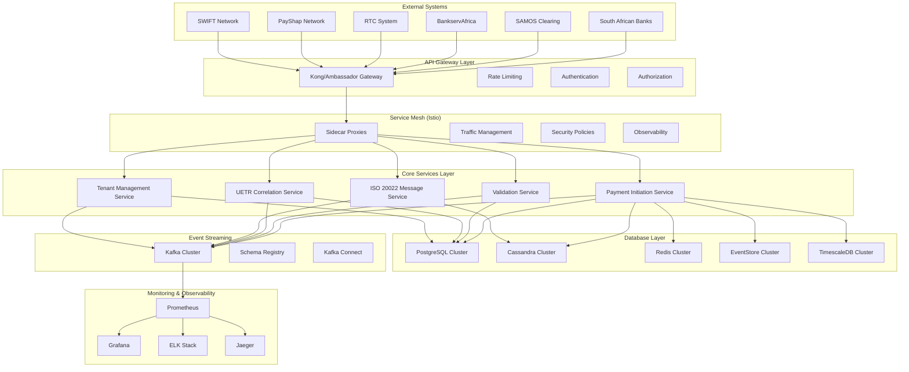
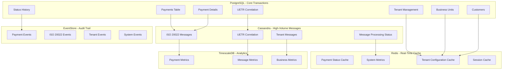
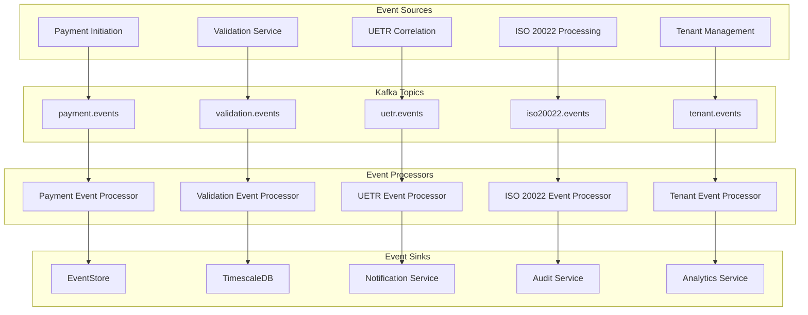
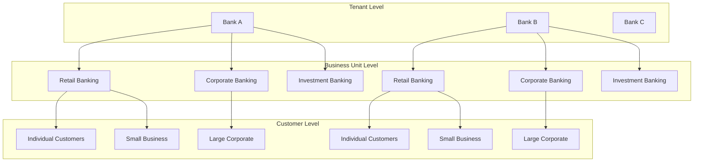
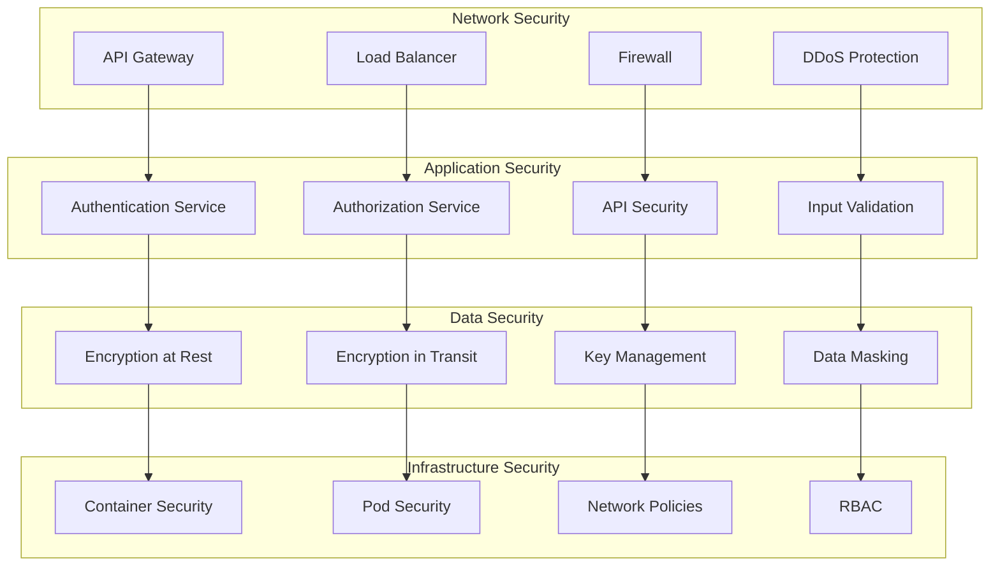
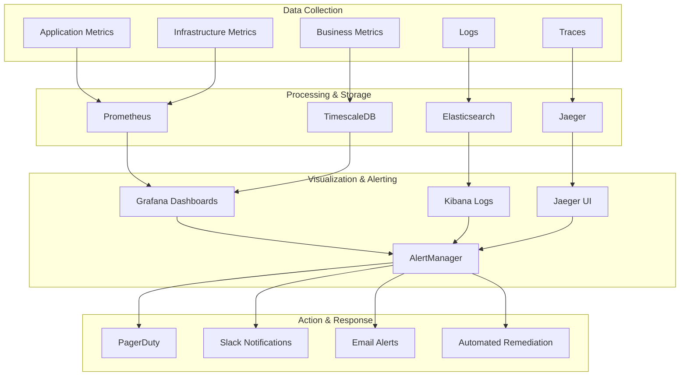
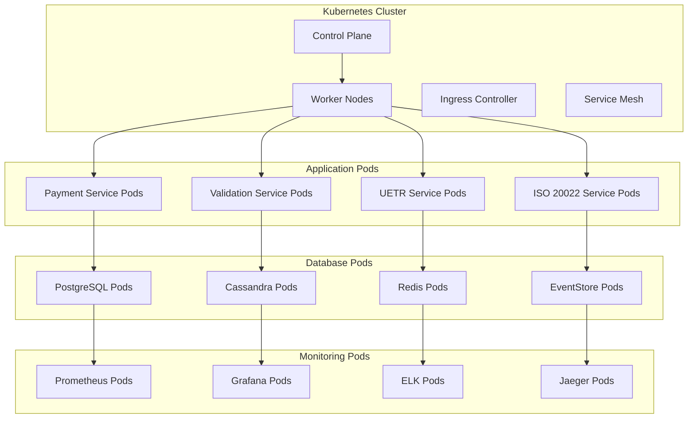
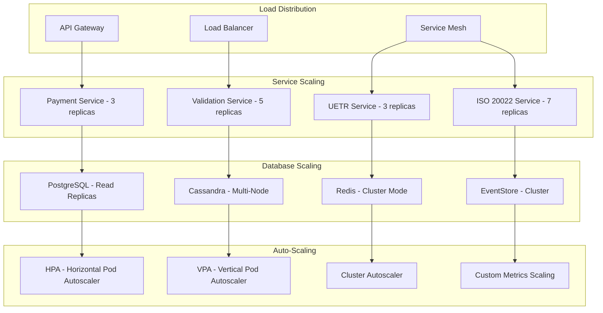
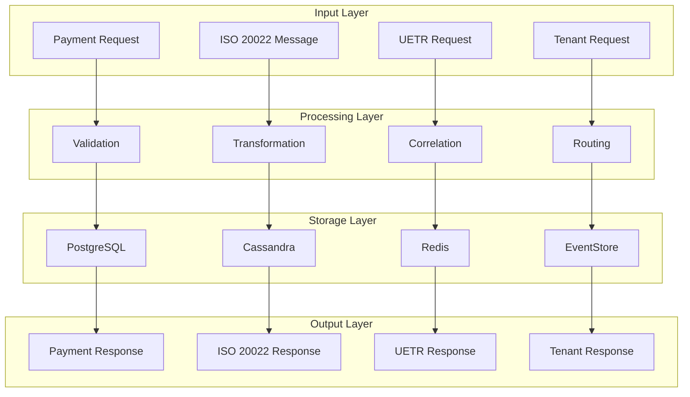

# Phase 0 High-Level Design - Foundation Layer

## 🏗️ **Senior Software Architect Perspective (MAANG Experience)**

**Architect**: Senior Software Architect with 15+ years experience in MAANG companies  
**Design Date**: 2024  
**Phase**: Phase 0 - Foundation Layer  
**Focus**: Scalable, resilient, and maintainable foundation for South African banking infrastructure

---

## 🎯 **Design Principles**

### **1. Scalability First**
- **Horizontal Scaling**: All components designed for horizontal scaling
- **Auto-scaling**: Kubernetes-based auto-scaling with HPA and VPA
- **Load Distribution**: Intelligent load balancing across multiple instances
- **Database Sharding**: Prepared for database sharding as volume grows

### **2. Resilience & Fault Tolerance**
- **Circuit Breaker Pattern**: Prevent cascade failures
- **Bulkhead Pattern**: Isolate critical resources
- **Retry with Exponential Backoff**: Handle transient failures
- **Graceful Degradation**: Maintain core functionality during partial failures

### **3. Observability & Monitoring**
- **Distributed Tracing**: End-to-end request tracking
- **Metrics Collection**: Business and technical metrics
- **Structured Logging**: Consistent log format across all services
- **Alerting**: Proactive issue detection and notification

### **4. Security by Design**
- **Zero Trust Architecture**: Never trust, always verify
- **Defense in Depth**: Multiple security layers
- **Encryption Everywhere**: Data at rest and in transit
- **Principle of Least Privilege**: Minimal required permissions

---

## 🏛️ **High-Level Architecture Overview**

---

## 🗄️ **Database Architecture Design**

### **Polyglot Persistence Strategy**

---

## 🔄 **Event-Driven Architecture Design**

### **Event Flow Architecture**

---

## 🏢 **Multi-Tenant Architecture Design**

### **Tenant Hierarchy & Data Isolation**

---

## 🔐 **Security Architecture Design**

### **Multi-Layer Security Model**

---

## 📊 **Monitoring & Observability Design**

### **Comprehensive Observability Stack**

---

## 🚀 **Deployment Architecture Design**

### **Kubernetes-Based Deployment**

---

## 📈 **Scalability Design Patterns**

### **Horizontal Scaling Strategy**

---

## 🔄 **Data Flow Architecture**

### **End-to-End Data Flow**

---

## 🎯 **Key Design Decisions**

### **1. Database Selection Rationale**
- **PostgreSQL**: ACID compliance for critical transactions
- **Cassandra**: High-volume, write-optimized for messages
- **Redis**: Sub-millisecond response times for caching
- **EventStore**: Immutable audit trails for compliance
- **TimescaleDB**: Time-series analytics and reporting

### **2. Event-Driven Architecture**
- **Kafka**: High-throughput, fault-tolerant event streaming
- **Schema Registry**: Versioned schema management
- **Event Sourcing**: Complete audit trail and state reconstruction
- **CQRS**: Separation of read and write models

### **3. Multi-Tenant Strategy**
- **Row-Level Security**: Database-level tenant isolation
- **Tenant Context**: Request-scoped tenant information
- **Resource Isolation**: Separate resources per tenant
- **Configuration Management**: Tenant-specific settings

### **4. Security Strategy**
- **Zero Trust**: Never trust, always verify
- **mTLS**: Mutual TLS for service-to-service communication
- **RBAC**: Role-based access control
- **Encryption**: End-to-end encryption for sensitive data

---

## 📊 **Performance Characteristics**

### **Expected Performance Metrics**
- **Throughput**: 2000+ TPS
- **Message Volume**: 8,200+ messages/second
- **Response Time**: <100ms for 95th percentile
- **Availability**: 99.99% uptime
- **Scalability**: Linear scaling with added resources

### **Resource Requirements**
- **CPU**: 32+ cores per service
- **Memory**: 64+ GB per service
- **Storage**: 1TB+ for databases
- **Network**: 10Gbps+ bandwidth
- **Kubernetes**: 20+ nodes cluster

---

## 🔧 **Technology Stack**

### **Core Technologies**
- **Runtime**: Java 17, Spring Boot 3.x
- **Database**: PostgreSQL 15, Cassandra 4.x, Redis 7.x
- **Event Streaming**: Apache Kafka 3.x
- **Container**: Docker, Kubernetes 1.28+
- **Service Mesh**: Istio 1.19+
- **Monitoring**: Prometheus, Grafana, ELK Stack, Jaeger

### **Cloud Platform**
- **Primary**: Azure (South African regions)
- **Secondary**: AWS (for global reach)
- **CDN**: Azure Front Door
- **Storage**: Azure Blob Storage
- **Key Management**: Azure Key Vault

---

## 📝 **Conclusion**

This high-level design provides a comprehensive foundation for the Payments Engine v2 Phase 0 implementation. The architecture is designed for:

- **Scalability**: Horizontal scaling across all components
- **Resilience**: Fault tolerance and graceful degradation
- **Security**: Multi-layer security with zero trust principles
- **Observability**: Comprehensive monitoring and alerting
- **Compliance**: South African banking regulations and standards

The design follows MAANG-level engineering practices with emphasis on:
- **Microservices architecture** with clear boundaries
- **Event-driven design** for loose coupling
- **Polyglot persistence** for optimal data handling
- **Cloud-native deployment** with Kubernetes
- **Comprehensive observability** for operational excellence

This foundation will support the subsequent phases of the Payments Engine v2 implementation while maintaining the highest standards of engineering excellence.
