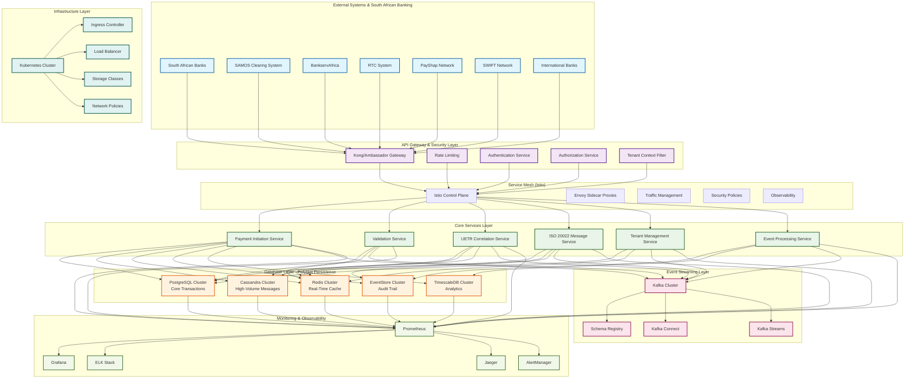
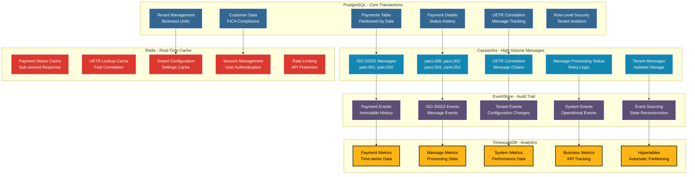
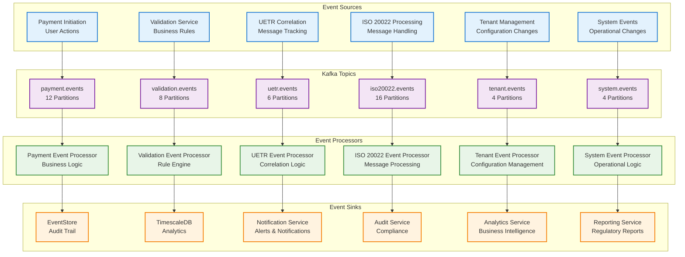
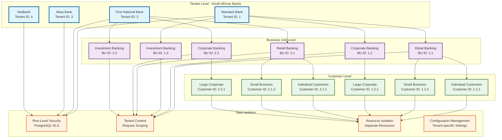
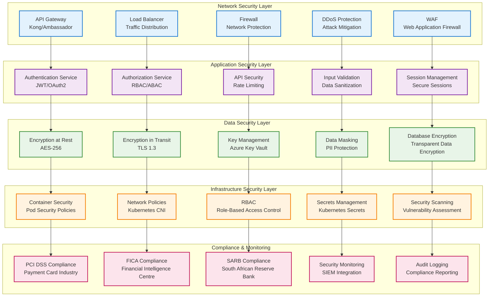
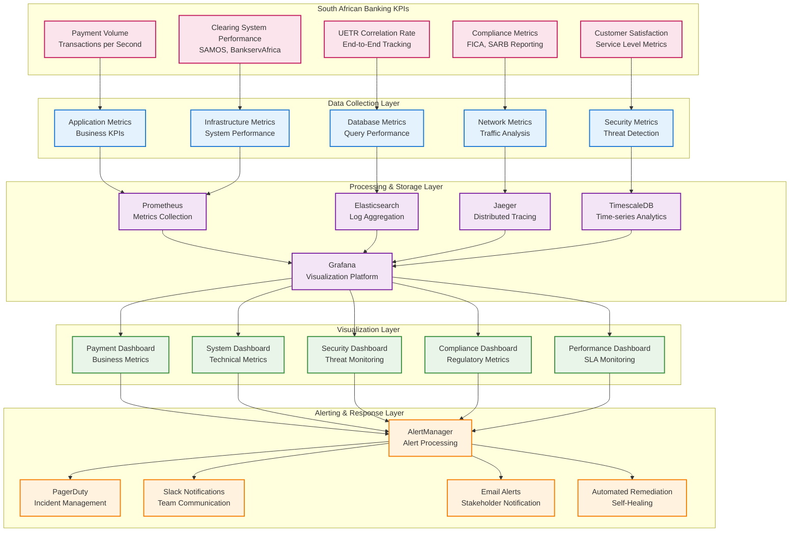
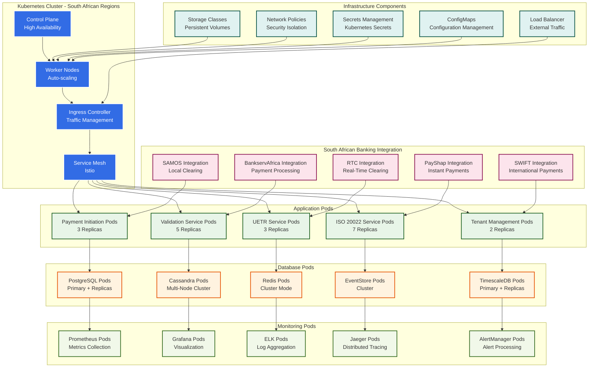
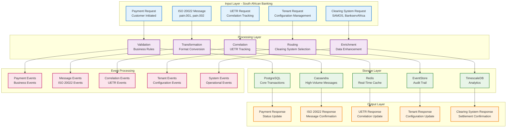

# Phase 0 Architecture Diagram - Foundation Layer

## 🏗️ **Comprehensive Architecture Visualization**

**Architect**: Senior Software Architect with 15+ years experience in MAANG companies  
**Design Date**: 2024  
**Phase**: Phase 0 - Foundation Layer  
**Focus**: Complete architectural visualization for South African banking infrastructure

---

## 🎯 **Architecture Overview Diagram**

---

## 🗄️ **Database Architecture Diagram**

---

## 🔄 **Event-Driven Architecture Diagram**

---

## 🏢 **Multi-Tenant Architecture Diagram**

---

## 🔐 **Security Architecture Diagram**

---

## 📊 **Monitoring & Observability Diagram**

---

## 🚀 **Deployment Architecture Diagram**

---

## 📈 **Data Flow Architecture Diagram**

---

## 🎯 **Key Architecture Insights**

### **1. Scalability Patterns**
- **Horizontal Scaling**: All services designed for horizontal scaling
- **Auto-scaling**: Kubernetes HPA and VPA for dynamic scaling
- **Load Distribution**: Intelligent load balancing across instances
- **Database Sharding**: Prepared for database sharding as volume grows

### **2. Resilience Patterns**
- **Circuit Breaker**: Prevent cascade failures
- **Bulkhead**: Isolate critical resources
- **Retry Logic**: Handle transient failures gracefully
- **Graceful Degradation**: Maintain core functionality during partial failures

### **3. Security Patterns**
- **Zero Trust**: Never trust, always verify
- **Defense in Depth**: Multiple security layers
- **Encryption Everywhere**: Data at rest and in transit
- **Principle of Least Privilege**: Minimal required permissions

### **4. Observability Patterns**
- **Distributed Tracing**: End-to-end request tracking
- **Metrics Collection**: Business and technical metrics
- **Structured Logging**: Consistent log format across services
- **Proactive Alerting**: Issue detection and notification

### **5. South African Banking Compliance**
- **FICA Compliance**: Customer data handling and audit trails
- **SARB Requirements**: Regulatory reporting and compliance
- **Local Clearing Systems**: SAMOS, BankservAfrica, RTC, PayShap integration
- **Data Protection**: South African data protection laws compliance

---

## 📊 **Performance Characteristics**

### **Expected Performance Metrics**
- **Throughput**: 2000+ TPS with horizontal scaling
- **Message Volume**: 8,200+ messages/second with Cassandra
- **Response Time**: <100ms with Redis caching
- **Availability**: 99.99% with multi-AZ deployment
- **Scalability**: Linear scaling with added resources

### **Resource Requirements**
- **CPU**: 32+ cores per service
- **Memory**: 64+ GB per service
- **Storage**: 1TB+ for databases
- **Network**: 10Gbps+ bandwidth
- **Kubernetes**: 20+ nodes cluster

---

## 🔧 **Technology Stack**

### **Core Technologies**
- **Runtime**: Java 17, Spring Boot 3.x
- **Database**: PostgreSQL 15, Cassandra 4.x, Redis 7.x
- **Event Streaming**: Apache Kafka 3.x
- **Container**: Docker, Kubernetes 1.28+
- **Service Mesh**: Istio 1.19+
- **Monitoring**: Prometheus, Grafana, ELK Stack, Jaeger

### **Cloud Platform**
- **Primary**: Azure (South African regions)
- **Secondary**: AWS (for global reach)
- **CDN**: Azure Front Door
- **Storage**: Azure Blob Storage
- **Key Management**: Azure Key Vault

---

## 📝 **Conclusion**

This comprehensive architecture diagram provides a complete visualization of the Phase 0 Foundation layer for the Payments Engine v2. The architecture is designed for:

- **Scalability**: Horizontal scaling across all components
- **Resilience**: Fault tolerance and graceful degradation
- **Security**: Multi-layer security with zero trust principles
- **Observability**: Comprehensive monitoring and alerting
- **Compliance**: South African banking regulations and standards

The design follows MAANG-level engineering practices with emphasis on:
- **Microservices architecture** with clear boundaries
- **Event-driven design** for loose coupling
- **Polyglot persistence** for optimal data handling
- **Cloud-native deployment** with Kubernetes
- **Comprehensive observability** for operational excellence

This foundation will support the subsequent phases of the Payments Engine v2 implementation while maintaining the highest standards of engineering excellence expected in MAANG-level implementations.
